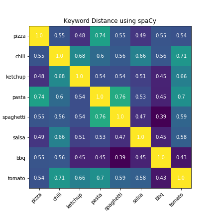
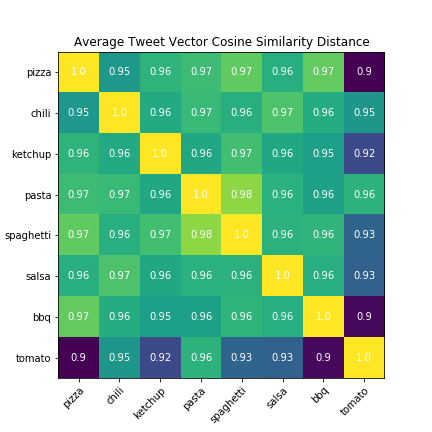
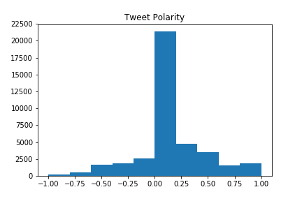
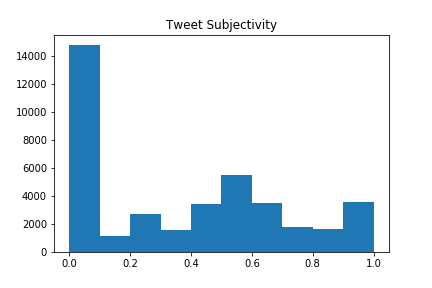
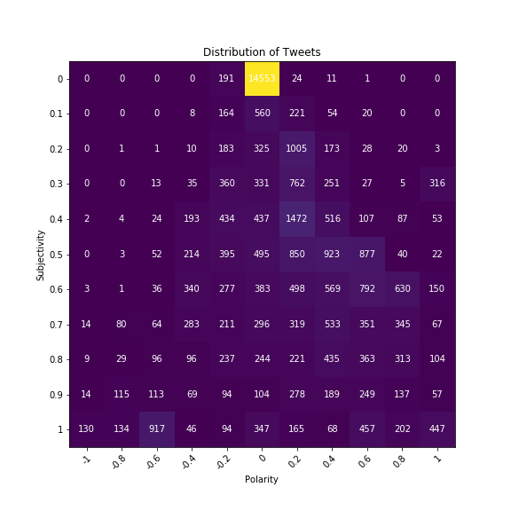
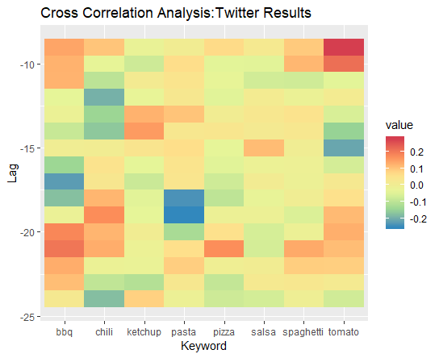

# Methodology {#methodology .unnumbered}

## Data {#methodology-data .unnumbered}

### Scholle Data {#methodology-scholle .unnumbered}
Scholle provided a data file in the form of an excel document that included sales record data from 2010-2018. The following table describes the relevant columns from the data file.

**INSERT TABLE OF SCHOLLE COLUMNS HERE.**

Based on discussions with Scholle's management, we removed any sales transactions that were marked with a Quantity less than or equal to zero. This was due to the data being extracted from their sales system in which negative or zero quantity records were used to true up returns or modify existing order pricing which were not relevant to our analysis.

##Descriptive Analyses {#methodology-Descriptive-Analyses .unnumbered}

### Exploratory Data Analysis {#methodology-EDA .unnumbered}

We began with exploratory data analysis to help understand the Scholle data and decide how to approach the problem of forecasting bag sales. Quantity is the primary focus as it describes the number of bag shipments.

#### Distribution of Quantity {#methodology-EDA-Distr-Quantity .unnumbered}

Order quantity is typically less than 50,000 bags, with a few orders significantly higher. Specifically, most order quantities are less than 30,000 bags. See \@ref(fig:Quantity_Histogram) below for histogram of Quantity.

```{r Quantity_Histogram, echo=FALSE, warning=FALSE,  message=FALSE, fig.cap="Histogram of Quantity", fig.width=6}
folder <- "C:/Users/Bob/Desktop/Capstone"
rawdata <- read.csv(paste(folder,"Sales_data_for_Capstone_Project_-_Student_Version_-_v3_CLEAN.csv",sep = "/"))
coerce_cols <- c("fiscalquartername","FiscalPeriod","Company","Top_Most_BP","BusinessPartner","Item_Number","Item_Description","Ship_to_State","Ship_to_City","Line_of_Business")

rawdata[coerce_cols] <- lapply(rawdata[coerce_cols],as.factor)

rawdata$Planned_Delivery_Date <- as.Date(rawdata$Planned_Delivery_Date)
cols_of_interest <- c("Company","Top_Most_BP","Item_Number","Ship_to_State","Quantity","Planned_Delivery_Date","Line_of_Business")
df <- rawdata[cols_of_interest]
levels(df$Line_of_Business) <- c("CITRUS","PFOTHR","TOMATO","TROPCL")

#Filter to only Tomato
df <- df[df$Line_of_Business=="TOMATO",]
library(ggplot2)
#Quantity Distribution
ggplot(df,aes(x=Quantity))+
  geom_histogram()+
  scale_x_continuous(labels = scales::comma)
```

Quantity is not normally distributed but is instead heavily skewed left. Large quantity orders are atypical and could have significant impact on models.

####Distribution of Quantity over time {methodology-QvsT .unnumbered}

The figure below plots the aggregated Quantity over time. 

```{r Quantity_Time, echo=FALSE, warning=FALSE,  message=FALSE, fig.cap="Quantity over Time", fig.width=6}
library(lubridate)
library(dplyr)
library(stringr)
library(tidyr)
#Quantity vs. Planned Delivery Date
proc_data <- df %>%
  #mutate produces month & year columns
  mutate(month = format(Planned_Delivery_Date, "%m"), year = format(Planned_Delivery_Date, "%Y")) %>%
  #groupby gets me each of the data elements
  group_by(month, year, Item_Number) %>%
  #summarise gets me the sum of quantity
  summarise(tot = sum(Quantity)) 

#generate time series complete data
proc_data_complete <- proc_data%>%
  #add in a column for the first of the month to be processed as date data
  mutate(dt = paste(year,month,"01",sep="-")) %>%
  #add a date/time version of Date
  mutate(Date=as.Date(dt))%>%
  #complete the 
  complete(Item_Number,Date = seq.Date(min(Date), max(Date), by="month")) %>%
  #modify the total column to replace NA's
  mutate(tot = if_else(is.na(tot),0,tot))
proc_data_complete%>%
  group_by(Date)%>%
  summarise(tot = sum(tot))%>%
  ggplot(aes(x=Date, y=tot))+
  geom_line()+
  scale_y_continuous(labels = scales::comma)+
  ylab("Aggregate Bag Quantity")+
  xlab("Planned Delivery Date")+
  ggtitle("Aggregate Bag Quantity Vs. Planned Delivery Date")
```

There is a large degree of seasonal behavior. Tomato bag shipments increase during summer time from June to August and begin to drop off in September and October. Quantity is very small during other months of the year. This seasonality is easier to observe in the chart below which aggregates bag shipments for each month of the year.

```{r Quantity_Month, echo=FALSE, warning=FALSE,  message=FALSE, fig.cap="Monthy Quantity by Year", fig.width=6}
proc_data_complete %>%
  group_by(Date)%>%
  ggplot(aes(x = year, y = tot))+ 
  geom_col() + 
  scale_y_continuous(labels=scales::comma) +
  facet_wrap(~ month)+
  scale_x_discrete(labels =c("2010","","","","2014","","","",""))+
  ylab("Aggregate Bag Quantity")+
  xlab("Planned Delivery Date")
```

There is little year to year variation exhibited in each month, with the possible exception of June which increased from 2010 to 2015 and then decreased from 2016-2018.

####Quantity by Item Number {#methodology-IN .unnumbered}

In addition to exploring the shipment quantity by time, we also observed the effect that the Item Number on Quantity. Over 86% of shipments are driven by the top 10 out of a total of 60 item numbers.
```{r IN_cumulative, echo=FALSE, warning=FALSE,  message=FALSE, fig.cap="Cumulative Sales by Item Number", fig.width=6}
#Cumulative aggregate by Item Number
totals_by_Item_Number <- aggregate(Quantity~Item_Number,data=df,sum)
totals_by_Item_Number <- totals_by_Item_Number[order(totals_by_Item_Number$Quantity,decreasing = T),]

tot_IN_cum_sum <- cumsum(totals_by_Item_Number$Quantity)
cum_tot_pct <- tot_IN_cum_sum / sum(totals_by_Item_Number$Quantity)
cum_tot_pct <- as.data.frame(cum_tot_pct)
cum_tot_pct$ID <- seq(1,length(cum_tot_pct$cum_tot_pct), by=1)
ggplot(data=cum_tot_pct,aes(x=ID,y=cum_tot_pct))+
  geom_point()+
  labs(x="Item Number Index",y="Percent Total",title="Cumulative Aggregate Quantity By Item Number Index") +
  geom_vline(xintercept = 10)+
  geom_text(aes(x=20,y=0.86),label=paste("Top Ten:",prettyNum(cum_tot_pct[10,]$cum_tot_pct*100,big.mark = ",",format="d",digits=2),"%"))+
  scale_y_continuous(labels = scales::percent)
```

```{r}
proc_data_complete %>%
  group_by(Item_Number)%>%
  summarise(tot=sum(tot))%>%
  arrange(desc(tot))%>%
  select(Item_Number)%>%
  head(10)-> top10
#needs to be converted to string
top10 <- as.character(top10$Item_Number)
library(forcats)
proc_data_complete$Item_Number <- fct_relevel(proc_data_complete$Item_Number,top10)
proc_data_complete%>%
  filter(Item_Number %in% top10)%>%
  group_by(Item_Number,Date)%>%
  ggplot(aes(x=Date, y=tot,color=Item_Number))+
  geom_line()+
  scale_y_continuous(labels = scales::comma)+
  ylab("Aggregate Bag Quantity")+
  xlab("Planned Delivery Date")+
  ggtitle("Top 10 Item Number Quantity by Planned Delivery Date")
```

Quantity by Item Number does not greatly vary greatly from the aggregated Quantity. Because the seasonal nature of the data is so strong, we will consider the shipment quantity aggregated to the monthly level.

## Descriptive analyses {#methodology-descriptive .unnumbered} 

###External Data Collection

We collected Social Media data from two sources: Twitter and the Google Trends. Google Trends summarised US monthly search statistics from 2004 to 2019. The twitter data collected are of US users from 2007 to 2018.

Google Trends returns a single value showing how frequently a given search term (e.g. ‘Tomato’) goes in Google’s search engine relative to its total search frequency for a given period. 

Twitter data were gathered by collecting relevant tweets from Twitter using key search words  as shown in Table __ below. We can grab a tweet based on defined keyword from Twitter by calling the Twitter API function. Subsequently, we can categorize opinions expressed in a piece of text, in order to determine opinion on our research (i.e, positive, negative, or neutral). 

```{r External_Data,echo=FALSE}
library(kableExtra)
External_Data_Source <- c('Google Trend','Twitter')
Frequency_Granularity <- c('Monthly','Monthly')
Range <- c('2004-2019','2007-2019')
Size <- c('182','')
Data_Type <- c('Numeric','Text, Numeric')
test_table <- cbind(External_Data_Source,
                    Frequency_Granularity,
                    Range,
                    Size,
                    Data_Type)
test_table <- data.frame(test_table)
colnames(test_table) <- c('External Data Source','Frequency Granularity','Range','Size','Data Type')

kable(test_table, digit = 7, align = "r", caption = "External Data Sources", 
      format = "markdown", longtable = TRUE)
```

Table __External_Data above shows the description of the social media dataset. The google trend dataset based on relative search frequency is on a monthly basis. The monthly dataset at the time of reporting has 182 rows.

The Twitter data are sampled via a quasi-random approach that grabs data monthly over the entire period of  2007 - 2018. We had to employ this method of querying due to the nature of the Twitter API and its restrictions on total tweets returned. The Twitter API returns tweets in reverse chronological order. The total number of tweets that would mention one of our keywords would be vastly larger than the number we could collect over the course of our data collection period (January 2019 - March 2019). Limited in this way, we decided to strategically collect tweets from each month of the year between January 2007 and March 2019.

**Assumptions & Limitations**
 
Google Trends
Assumptions
We limited the Google Trends search to the United States.
The keywords are independent of each other.

Limitation: The actual number of searches for the term being queried is not made available. Instead, the data are reported from 0-100, where 100 represents the maximum relative search frequency.

Resolution: Each term selected will be queried individually.
 
**Twitter Datasets**
Assumptions
We limited Twitter data to the United States.
The frequency of tweets we collected for each keyword will be independent of the time period in which we collected them.

Limitations 
The demographic information of the twitter account user cannot be determined.
With the limitation of our premium account API activity, we can only submit 100 requests to collect tweet per month. Per each request, we can get a maximum of 500 tweets back.
The language associated with the Twitter account returned from the API does not guarantee the language of the Tweet. While we specified English language tweets, we received many tweets that were not in English. We subsequently dropped these tweets.

**Plan for use**
 
Twitter data
We developed a sentiment index for all tweets using natural language processing techniques
tilizing the textblob Library to analyze how similar or discrepant the meaning of tweets among each keyword

Google Trends
Correlation analysis of frequency of individual search terms compared to quantity
Subsequent seasonality & trend analysis to identify meaningful predictors

Twitter Data

We have collected tweets based on the keywords in Table 3 below. Tweets were aggregated on a monthly basis. The figure below shows how frequently the keywords appears in the returned tweets over time. Pizza is more frequently mentioned in Twitter than other keywords.

Google Trend Analysis

We collected Google Trend data consisting the same keywords as we did in Tweet collection. The Google Trends data was standardized and subsequently the cross correlation was found with respect to the Scholle bag sales. Figure __ displays the results of the cross correlation analysis.


```{r Lags_Google,echo=FALSE}
library(kableExtra)
df_Google_Lags_path = "./data/Google_Lags.csv"
df_Google_Lags = read.csv(df_Google_Lags_path)
kable(df_Google_Lags, digit = 7, align = "r", caption = "Google Lags", 
      format = "markdown", longtable = TRUE)
```

In Table __Lags_Google above, we highlight cross-correlations greater than 0.5 and with a time period of greater than 8 months. Since the Scholle bag sales data are records of the demand are placed well in advance of the desired delivery date, we would expect a long lag window in order for the trends of social media to drive market forces that would affect demand. Red indicates positive relations and blue indicates negative correlations. The deeper the color, the greater its correlation with Scholle’s data. 

###Tweet Sentiment Analysis {.unnumbered}
We have conducted the following steps to conduct the sentiment analysis of the tweets.

**Text Cleanup Pipeline:**
1. Remove RT, URLs and non-text characters (except @ and punctuation symbols)
2. Handle mentions by replacing with upper case letters.
3. Remove all remaining non-text characters (including @ symbol and excluding punctuation symbols).
4. Check the language of the cleaned up tweet and drop any tweets that are not in English.

**SpaCy Pipeline:**

We used the spaCy English Core Web Large model to analyze each tweet to process into three data sets:
1. Tokenization - each tweet was broken into its component elements of words, punctuation, etc.
2. Dependency Parsing - Annotate the tweet to add the syntactic dependency within the tweet i.e. compare link verbs to their respective nouns.
3. Named Entities - Each tweet was analyzed to identify the named entities in the tweet. These entities will include the mentions because they were capitalized in the Text Cleanup Pipeline.
4. Removal of stop words - all stop words identified were removed.

**Vector Extraction:**

Spacy includes vector representations for individual words as well as entire entire sentences. See Figure 22 below for the Keyword Distance using Spacy.These are represented as 300 dimension Numpy arrays. To begin, we confirmed that were was a reasonable cosine distance measure between each of the keywords.



There is a reasonable distance between each of the keywords with the exception of bbq and barbecue but this is to be expected since they reference the same thing.

In addition, vectors representations of each tweet can be extracted. For each tweet keyword we summarised all vectors by finding their mean values for each dimension. We then found the pairwise distance measures for these ‘average’ tweets. See in the figure below



Here, the “average” tweets are rather similar to each other with the greatest distance from tomato to salsa. 

In future work we will leverage these vector representations of the tweets to conduct transfer learning to identify tweet sentiment.

**Sentiment Analysis using TextBlob**

TextBlob is an open source Python library for conducting natural language processing. It has a built in sentiment analyzer that utilizes two axes of analysis Polarity and Subjectivity. 
Polarity refers to a positive or negative sentiment and ranges from positive one to negative one respectively. Subjective expresses the subjectivity or objectivity of the text. See Figure 24 below for the Tweet Polarity. The subjectivity axis ranges from zero to positive one where 0 is very objective and 1 is very subjective. See Figure 25 below for the Tweet Subjectivity .







TextBlob categorizes the vast majority of tweets as non-subjective non-polar.

With the tweets collected, we generated a sentiment index by taking each tweet’s subjectivity & polarity and multiplied them by the retweet count for that tweet. We then aggregated the sentiment index at the monthly level for each keyword. The cross correlation between the Scholle data and the sentiment monthly index for the overall sentiment and for each keyword was calculated and the results displayed in the figure below.



It is important to note the difference in scale relative to the Google Trends results; the correlations to the Twitter sentiment index are much weaker.

The table below compiles the list of lagged values used in our analysis.
```{r Tweet_Lag,echo=FALSE}
library(kableExtra)
df_Twitter_Lags_path = "./data/Twitter_Lags.csv"
df_Twitter_Lags = read.csv(df_Twitter_Lags_path)
kable(df_Twitter_Lags, digit = 7, align = "r", caption = "External Data Sources", 
      format = "markdown", longtable = TRUE)
```

## Modeling Framework {#methodology-modeling .unnumbered}

### Model Selection Metrics {#methodology-ModelSelectionCriteria .unnumbered}

In order to determine the best model, we began by choosing selection metrics to test each model. The following metrics outlined below will be used to measure the performance of each model.
1. SMAPE 
2. RMSE 
3. % bias – no of time above forecast vs below.
4. Accuracy

**sMAPE -Symmetric Mean Absolute Percentage Error**

Symmetric mean absolute percentage error (sMAPE) is an accuracy measure based on percentage (or relative) errors. It allows us to understand error independent of scale.

$$sMAPE=\frac{100\%}{n}\frac{|A_t-F_t|}{(|A_t|+|F_t|)/2}$$

sMAPE has a lower bound of 0% and an upper bound of 100%.  The best value is 0% while the worst value is 100%.

The major limitation with sMAPE is that it gives more penalties to underestimates than overestimates.


**RMSE - Root Mean Squared Error**

The root mean squared error (RMSE) of an estimator measures the average of the squares of the errors—that is, the average squared difference between the estimated values and what is estimated. The square root of this value is then taken to produce the RMSE.

$$RMSE = \sqrt{\frac{\sum^n(A_t-F_t)^2}{n}}$$

RMSE measures  the variation between predicted and measured values and it provides us a basis for measuring the model variance on the same scale as the data.

The RMSE is a measure of the quality of an estimator. RMSE is always non-negative, as the process of squaring removes any negative signs. It also penalizes larger differences. The best value is zero while the worst value is unbounded.

In sum, the lower the RMSE, the smaller the error, the better the estimator.

**Percent Bias – ratio of model high or low.**

Bias refers to the propensity of a measurement process to over- or under-estimate the value of a population parameter. Percent bias (PBIAS) measures the average tendency of the predicted values to be larger or smaller than the actual values.

Percent Bias is calculated by taking the sign of the residual for each data point and setting positive values to 1 and negatives values to zero. These are then averaged and multiplied by 100 to produce a percentage. The best percentage bias is 50% - there are just as many over predictions as under predictions. The worst percentage bias is either 0% or 100% as the model is regularly over- or under-estimating the actual data.

**Accuracy - Mean Accuracy between Model & Actual**

Accuracy measures the closeness of a model prediction to the actual value. In our case we are measuring the mean accuracy for all model predictions versus actual values. The best accuracy measure is 1; the prediction and the actual are the same so their ratio is 1. Accuracies that diverge from 1 are bad; a value greater than 1 means the prediction was higher than the actual while a value below 1 is means the predictions was lower than the actual. We aggregate the accuracy measure for each data point and find the overall mean. One precaution to consider by using this procedure is it may mask an underlying trend in prediction of the accuracy in which the model could overestimate early and then underestimate late or other non-linear behavior.

### Additional Modeling Considerations {#methodology-AdditionalConsiderations .unnumbered}


**Training and Forecasting Windows**

In order to evaluate our model to avoid either overfitting or underfitting , we split our dataset into a training set and a test set. Based on our discussions with Scholle, the test set will be the subsequent 18 months. The length of the training period was chosen based on the evaluation of the model stability of our baseline model using a rolling window cross validation.

**Rolling Window Cross Validation**

Time series data present a unique challenge in analysis in that the data are not independent - they are collected at regular intervals over the course of time. We employed rolling window cross validation to generate multiple train and test sets from the overall data set. Initially we explored the model stability of our baseline model and used the best criteria from that in order to decide the length of the cross validation window.
