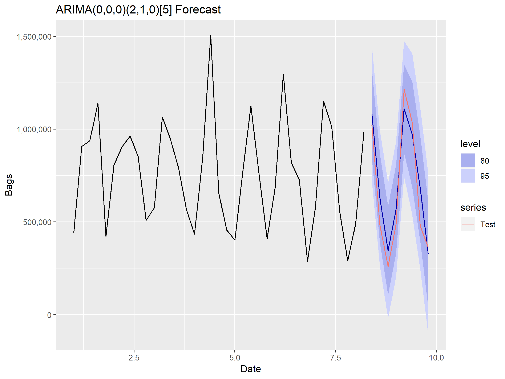

---
output:
  html_document: default
  pdf_document: default
---
# Findings {#findings .unnumbered}

## Results of descriptive analyses  {#findings-descriptive .unnumbered}

Because of the highly seasonal nature of the data, we created a baseline model using only Scholle data. We used periods of 2-year, 4-year and 6-year windows, to identify the forecast window period with the greatest stability.


###Baseline Model - Prophet {#findings-baseline.unnumbered}

Prophet is an open-source tool developed by Facebook to conduct time series modeling. Prophet models data using a decomposable time series model with three main components: trend, seasonality, and holidays. The focus is to model the time series via regression instead of as a generative model like ARIMA would. This is done for flexibility, the ability to handle irregularly spaced data, speed, and interpretability.

**Cross-Validation Window Selection**

The figures below show results of the cross-validation analysis at 2, 4 and 6 year training windows using the Prophet Model. 


For both sMAPE and RMSE, the 2 year window shows much higher variability than the 4 or 6 year windows. Given the similarity of the 4 and 6 year windows RMSE, we chose the 4 year window to both reduce the data requirements of the model and allow for additional cross-validation of each other model. A 4 year cross validation allows us to generate 42 complete training and testing windows whereas A 6 year cross validation window only allows us to generate 18.

**Baseline Model Results**

The reported model metrics are the mean values for each of the cross validation periods collected.

```{r Prophet_Results,echo=FALSE}
df_Prophet_Results_path = "./data/Prophet_Results.csv"
df_Prophet_Results = read.csv(df_Prophet_Results_path)
kable(df_Prophet_Results, digit = 7, align = "r", caption = "External Data Sources", 
      format = "markdown", longtable = TRUE)
```

###Challenger Model sARIMA {#findings-sARIMA .unnumbered}

Seasonality is a key feature of the dataset, as it was observed that the Tomato bags  sales increase significantly during summer time from June to August and drop in September and October while repeating this cycle annually.This key attribute in the dataset  meant we deploy a model that uses differencing at a lag equalling the number of seasons to remove additive seasonal effect.

For this challenger, we split the data into two groupings; harvest months (June -October) and all months. In the Table 7 & 8 below, we summarise the result for the model:


```{r sArima_Results,echo=FALSE}
df_sArima_Results_path = "./data/sArima_Results.csv"
df_sArima_Results = read.csv(df_sArima_Results_path)
kable(df_sArima_Results, digit = 7, align = "r", caption = "Seasonal Arima", 
      format = "markdown", longtable = TRUE)
```

In the figure below, the mean forecast value is highlighted in blue and the actual value is captured in red, and the confidence interval ranging between 80%-95%. The actual values are represented in black.




###Challenger Model - Regression with ARIMA Errors {#findings-Regression .unnumbered}

The first challenger model we built is regression model with ARIMA errors. While the regression model allows for the inclusion of predictor variables, it does not allow for the subtle time series dynamics that can be handled with ARIMA models. The regression with ARIMA errors model solves this problem by fitting regression models with all the relevant variables first, and then applying ARIMA to the residuals of the regression to detect time series elements in the residuals. 

We explored the correlations of twitter data and Google trend Scholle tomato bag sales and found the keywords and lags in Table 4 and Table 6 tend to strongly correlated with tomato bag sales. Since the regression with ARIMA errors is based on linear regression, we first build a linear regression model these keywords and lags. Results are shown in below Table 10. Significant variables are highlighted in green.

Based on the variables significant in the linear model, we built the regression model with ARIMA errors. The parameters and accuracy are shown below in Table 11 and Table 12.


```{r All_Linear_Mod,echo=FALSE}
df_lmod_all_path = "./data/lmod_all.csv"
df_lmod_all = read.csv(df_lmod_all_path)
kable(df_lmod_all, digit = 7, align = "r", caption = "Linear Model", 
      format = "markdown", longtable = TRUE)
```

Based on the variables significant in the linear model, we built the regression model with ARIMA errors. The parameters and accuracy are shown below in Table  and Table 12.

```{r Stepped_Linear_Model, echo=FALSE}
df_lmod_step_path = "./data/lmod_step.csv"
df_lmod_step = read.csv(df_lmod_step_path)
kable(df_lmod_step, digit = 7, align = "r", caption = "Linear model with Regression Error", 
      format = "markdown", longtable = TRUE)
```

Positive coefficients imply that for a unit increase in the variable, there is a corresponding positive increase in the Scholle bag sales. Negative coefficients imply that for a unit increase in the variable, there is a corresponding negative decrease in the Scholle bag sales.The negative coefficient shows there is an inverse relationship between the  variable and Scholle bag sales.

```{r Reg_Arima_Err_Results,echo=FALSE}
df_lmod_arima_path = "./data/Reg_Arima_Results.csv"
df_lmod_arima = read.csv(df_lmod_arima_path)
kable(df_lmod_arima, digit = 7, align = "r", caption = "Regression with Arima Error Results", 
      format = "markdown", longtable = TRUE)
```

The above results indicate that Google trend data tend to have a greater influence in the predictions than twitter data, because the count in google searches is more direct in measuring the importance of the keywords and lags, compared to twitter data which might lose some information both due to the limitations in gathering tweet data and due to the complicated natural language preprocessing process. The ARIMA errors is (0,0,0), indicating our model has extracting enough informations and there’s no time series dynamics in the residuals.

###Challenger Model - Random Forest Regression {#findings-RF .unnumbered}

The second challenger model we built was a Random Forest Regression Model. Random Forest leverages many regression trees to build a consensus model in addition to bootstrap aggregation or bagging to generate additional augmented data. Bagging simply builds additional training sets by sampling with replacement from provided training data. Each individual tree uses the bagged training data and selects a random subset of features at each branching point rather than all features available to build the regression. This restriction forces the model to create a more robust estimator.

One useful feature when using tree-based approaches for regression is the ability to use categorical or ordinal predictors without the need for one-hot-encoding. In our model we represented the date as a pair of categorical variables, one for year and a second for month. We chose to do this because of the seasonal nature of the data.

In addition, we decided to challenge the model by only using lags that we thought to be have a reasonable explanation for their effect. To this end we chose to use lags greater than 9 months. Our logic was that it would take time for an increase or decrease in the social media presence of one of the keywords selected to go from an uptick in interest of consumer products to be captured by Scholle’s bag sales.

The table below displays the results of our Random Forest model.

```{r RF_Results, echo = FALSE}
df_RF_path = "./data/RF_Results.csv"
df_RF = read.csv(df_RF_path)
kable(df_RF, digit = 7, align = "r", caption = "Random Forest Results", 
      format = "markdown", longtable = TRUE)
```

An important feature of Random Forest modelling is its ability to generate rank-ordered summaries of variable importance. The model’s feature importance is displayed in the figure below.


The most important features are displayed at the top of this chart, in this the month was the most important predictor followed closely by google salsa data at lag 12. This agrees with the importance of monthly seasonality that we observed in the other models.

###Challenger Model - XGBoost {#findings-XGBoost .unnumbered}
XGBoost is an implementation of gradient boosted decision trees designed for speed and performance. It build trees one at a time, where each new tree helps to correct errors made by previously trained tree.

```{r xgb_Results,echo =FALSE}
df_xgb_path = "./data/xgb_Results.csv"
df_xgb = read.csv(df_xgb_path)
kable(df_xgb, digit = 7, align = "r", caption = "xgBoost Results", 
      format = "markdown", longtable = TRUE)
```

###Stacking Forecasts {#findings-Stacking .unnumbered}

Our project focuses on shipment quantity. There will inherently be some lag between the time someone has interaction on social media and its effect on the tomato bag shipments. Given that the vast majority of shipments occur during June through October, we limited the evaluation of model results to those months. These months coincide with when tomatoes become ripe in California, we thus refer to these months as the harvest months.

The stacking method is used to create an additional consensus model by using the results of trained models. We used two approaches to stacking, simple averaging and a linear model.

We then combined our forecast results from all models mentioned prior in this report, including the ARIMA model built only on the more stationary harvest months, the regression with ARIMA errors model using on strong correlated keywords and lags, random forest model, XGBoost model and Prophet model. We averaged the forecasts of all combinations of the models. We found that we were able to improve the model predictions by combining the Random Forest and Regression with Arima Error models predictions using a simple average.

The second approach to stacking we attempted was to build a linear model using the results of all our other models. This model was trained on all the harvest month data for 2014-2018. An important facet of a linear model is that it optimizes the weighting of each variable. Our case this is the model result. The fitted values produced a better estimate of the actual than the simple average of Random Forest and Regression with Arima Error. 

```{r LM_All,echo=FALSE}
LM_coef <- c(Intercept = -6428.4630100,
             Arima = 0.7431722,
             Arima_reg = -0.1683120,
             RF = 0.6933001,
             xgb = 0.3950322,
             pro = -0.5076684)
kable(LM_coef, digit = 7, align = "r", caption = "Model Blend Summary", 
      format = "markdown", longtable = FALSE)
```

However the best fitting linear model does not consider if each of the inputs adds to the total information that is represented in each of the variables added. To address this, we applied the step function to find the model that produces the lowest AIC.


Overall the linear model blend performed the best for both sMAPE and RMSE leading us to choose it as our champion model.

key:
* arima - 
* arima_reg - 
* xgb - 
* pro -

```{r ModelBlend,echo=FALSE}
blend_summary <- read.csv('./data/Model_Blend_Summary.csv')
kable(blend_summary, digit = 7, align = "r", caption = "Model Blend Summary", 
      format = "markdown", longtable = TRUE)
```

###Residual Analysis {#findings-Residual-Analysis .unnumbered}

```{r}
#plot each of the forecasts & the blend & actual
```


Residual analysis is an important final step because it helps us understand if our model has any systemic biases that we should be aware of going forward. 

```{r}
lm_all <- readRDS('./data/LM_Blender.rds')
par(mfrow=c(2,2))
plot(lm_blender)
par(mfrow=c(1,1))
```

```{r}
facts = c(mean = mean(lm_blender$residuals),
          median = median(lm_blender$residuals),
          variance = var(lm_blender$residuals),
          skewness = e1071::skewness(lm_blender$residuals),
          kurtosis = e1071::kurtosis(lm_blender$residuals))
          
kable(facts, digit = 2, align = "r", caption = "Model Blend Summary", 
      format = "markdown", longtable = FALSE)
```

**Breusch-Pagan test for heteroscedasticity**

```{r}
lmtest::bptest(lm_blender)
#p-value = 0.06462
```

**NCV test for heteroscedasticity**

```{r}
car::ncvTest(lm_blender)
# p = 0.23261
```

Both the Breusch-Pagan and NCV tests detect heteroscedasticity.